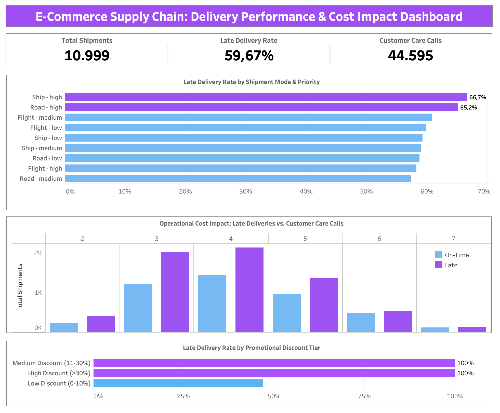

# E-Commerce Supply Chain: Delivery Performance Audit

Scaling a global e-commerce business is tough. You have to balance aggressive marketing campaigns and sales targets while making sure your logistics and supply chain don't collapse under the pressure.

This project is a **Commercial Supply Chain Audit** aimed at doing three things: establishing the true on-time delivery failure rate, identifying the root causes of logistics bottlenecks (such as priority routing and promotional surges), and quantifying the financial impact on Customer Care resources. The end goal is to equip executive management with a data-driven blueprint to recover operational efficiency and restore profitability.

The dataset was obtained from Kaggle: [**Dataset Source**](https://www.kaggle.com/datasets/prachi13/customer-analytics/data)

### The Business Questions

This audit is driven by four core questions critical to the company's operational turnaround:
1. What is the true On-Time Delivery (OTD) failure rate across all global shipments?
2. How do specific logistics dimensions, such as shipment mode and product priority, impact delivery success?
3. Is there a measurable correlation between heavy marketing discounts and fulfillment failure?
4. What is the operational cost impact of these late shipments on Customer Care resources?

### How I Built This

Transforming messy logistics data into a clear operational narrative requires a solid pipeline. Here is how I approached the workflow:

1. **Data Cleaning & Validation (SQL):** I used Google BigQuery to sanitize 10,999 raw transaction records. I handled schema parsing errors, checked for numerical outliers, validated missing values, and filtered out duplicate IDs to ensure structural integrity before analysis.
2. **Metric Engineering (BigQuery SQL):** To make the data actionable, I engineered custom commercial parameters using SQL `CASE WHEN` logic, creating binary classifications for delivery status (`Is_Late`) and calculating preliminary aggregate metrics to assess SLA compliance.
3. **Feature Engineering & Calculated Fields (Tableau):** To transform raw dimensions into interactive business metrics directly within Tableau Public, I created custom **Calculated Fields**:
   * **`[Late Rate %]`**: Evaluated the percentage of SLA failures by aggregating total late deliveries against total shipment volume (`SUM([Is_Late]) / COUNT([ID])`).
   * **`[Discount Tier]`**: Binned raw discount percentages into strategic business groups (`Low (0-10%)`, `Medium (11-30%)`, `High (>30%)`) using conditional logic to isolate promotional stress on fulfillment.
   * **Custom Categorical Labeling**: Applied calculated fields for clear categorical labeling (e.g., converting binary flags into executive-friendly `Late` vs. `On-Time` tags) to maximize visual clarity on the dashboard.
4. **Interactive Dashboarding:** I designed an *Executive Dashboard* in Tableau Public. By implementing a clean layout and strict visual hierarchy, I made it easy for stakeholders to isolate operational bottlenecks and map the direct impact of late deliveries on Customer Care call volume.

### What the Data Says (The Findings)

After a deep dive into the numbers, here is what stands out:

* **The Macro Crisis:** A staggering **59.67%** of all shipments fail to meet their delivery Service Level Agreements (SLA). This failure has forced customers to generate over 44,595 inbound calls, crippling cost efficiency.
* **The Priority Paradox:** Ironically, items marked as **"High Priority"** experience the highest failure rates. Shipments routed via Ship (66.7% late) and Road (65.2% late) under "High Priority" are the worst-performing segments. Paying for priority currently yields worse results than standard processing.
* **The Promotional Bottleneck:** The most alarming anomaly is tied to marketing. Orders with a Medium (11-30%) and High (>30%) discount suffer a catastrophic **100% Late Delivery Rate**. Sales campaigns are choking the supply chain, while low-discount items maintain manageable delivery times.
* **The Cost of Delays:** Customers experiencing late deliveries consistently drive the highest volume of inbound support inquiries. The distribution peaks at 3 to 4 calls per delayed order, turning the customer care center into a massive, reactive bottleneck.

### Strategic Recommendations

1. **Overhaul Promotional Routing:** Investigate warehouse algorithms immediately. Separate fulfillment pipelines must be established during marketing campaigns to prevent 100% SLA failure on discounted items.
2. **Audit "High Priority" SLAs:** Temporarily suspend "High Priority" offerings for Ship and Road freight until carriers can guarantee SLAs. Shifting critical items exclusively to Air freight may be necessary to salvage customer trust.
3. **Proactive CS Deflection:** To reduce the massive cost of 44,000+ support calls, implement automated, proactive SMS/Email delay notifications. Customers call less when they are preemptively informed of delays.

## 📊 Dashboard Preview

> **Interactive Version:** [View the Live Tableau Public Dashboard Here](https://public.tableau.com/views/E-commerceSupplyChain/Dashboard?:language=en-US&:sid=&:redirect=auth&:display_count=n&:origin=viz_share_link)

---
**David Sebastian Aritonang**  
Data Analyst | Turning messy data into strategic business decisions.  
Email: [davidsebastianartt@gmail.com](mailto:davidsebastianartt@gmail.com)  
LinkedIn: [linkedin.com/in/david-sartt](https://www.linkedin.com/in/david-sartt/)
